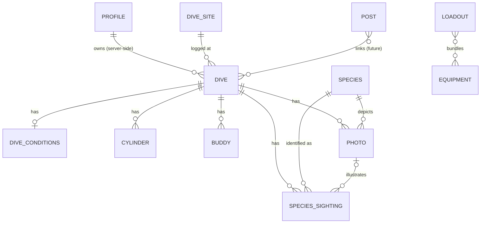

# Data Model

The full entity model for Depth Notes. Field types are Dart. This is the
reference; `ARCHITECTURE.md` holds the binding rules it follows.

## Conventions

- Every persisted entity has `String id` (UUID v7) and `DateTime updatedAt` (R15).
- Syncable entities also carry `DateTime? deletedAt` — deletes are soft (R41).
- No `userId` on any model. The owner is stamped server-side from `auth.uid()`; the client never filters by it (R23).
- All measurements stored metric — metres, °C, bar, kg, litres. The View converts (R32).
- Variable-fidelity quantities are sealed unions; coarse derives from fine (R39).
- Logbook entities **snapshot** facts at log time. No references to mutable templates (loadouts) or to local-only records (R40).

## Sync boundary

- **Synced:** `Dive` + satellites (`DiveConditions`, `Cylinder`, `SpeciesSighting`, `Photo`, `Buddy`), `Profile`, catalog (`DiveSite`, `Species`), and — later — `Post`.
- **Local-only (R42):** `Equipment`, `Loadout`, sync cursors, device settings (units, theme).

---

## Core

### Dive — synced
The thin logbook core: roughly what you'd write on a paper log page.

| field | type | req | notes |
|---|---|---|---|
| id | String | ✓ | UUID v7 |
| number | int | ✓ | sequential dive no.; editor suggests max+1 |
| date | DateTime | ✓ | calendar date |
| depth | double | ✓ | max depth, m |
| time | DiveTime | ✓ | embedded union |
| siteId | String | ✓ | FK → DiveSite; new place → create a local site first |
| entryType | EntryType? | | shore / boat |
| diveType | DiveType? | | fun / training / deco / work |
| weight | double? | | kg |
| rating | int? | | half-stars 0–10, shown as 0–5 |
| notes | String? | | quick catch-all |
| updatedAt | DateTime | ✓ | |
| deletedAt | DateTime? | | tombstone |

No `loadoutId` — a loadout only prefills the editor. `environment` lives on `DiveSite`.

---

## Value objects (embedded, no id)

### DiveTime
- `rough({DiveTimeOfDay timeOfDay, int duration})`
- `precise({DateTime timeIn, DateTime timeOut})`
- `int get duration` — stored on rough, derived on precise.

### Temperature — `DiveConditions.waterTemp`
- `rough(TempBucket bucket)`
- `single(double celsius)`
- `range({double surface, double bottom})` — average derived.

### Visibility — `DiveConditions.visibility`
- `rough(VisibilityBucket bucket)` — bad / medium / good
- `exact(double metres)`

### Abundance — `SpeciesSighting.abundance`
- `rough(AbundanceBucket bucket)` — single / few / many
- `exact(int count)`

### GasMix — `Cylinder.mix`, `CylinderTemplate.mix`
- `int o2Percent`, `int hePercent`
- `int get n2Percent` → `100 - o2Percent - hePercent` (derived; air = 21/0).

### Certification — `Profile.certifications`
- `String agency`, `String level`, `String? number`, `DateTime? date`.

### CylinderTemplate — `Loadout.cylinders`
- `CylinderMaterial material`, `double? volume`, `GasMix mix` (no pressures).

---

## Dive satellites (keyed by `diveId`, synced)

### DiveConditions — 1:1
| field | type | notes |
|---|---|---|
| diveId | String | PK = FK |
| waterTemp | Temperature? | |
| airTemp | double? | °C |
| visibility | Visibility? | |
| current | CurrentStrength? | none / light / moderate / strong |
| weather | Weather? | |
| seaState | SeaState? | null off open water; UI gates on `site.environment` |

### Cylinder — 1:N
`material: CylinderMaterial` (aluminium / steel) · `volume: double?` (L) · `mix: GasMix` · `startPressure: int?` (bar) · `endPressure: int?` (bar). Material/volume/mix prefill from a loadout; pressures are per-dive.

### SpeciesSighting — 1:N
`speciesId: String?` (FK → Species) · `speciesLabel: String?` (uncatalogued fallback) · `abundance: Abundance?` · `depthSeen: double?` (m) · `notes: String?` · `photoId: String?` (FK → Photo).

### Photo — 1:N (metadata synced; bytes separate, R21)
`localPath: String` · `remoteKey: String?` · `caption: String?` · `takenAt: DateTime?` · `speciesId: String?` (FK → Species).

### Buddy — 1:N
`name: String` · `linkedUserId: String?` (null today; social hook).

---

## User-scoped

### Profile — synced; `id` = auth uid
`displayName: String?` · `homeRegion: String?` · `certifications: List<Certification>`.

### Equipment — local-only, sealed union
Shared: `id`, `name`, `brand?`, `notes?`, `retiredAt?`.
- `Equipment.exposureSuit({SuitType suitType, int? thicknessMm})`
- `Equipment.generic({EquipmentCategory category})` — BCD, regulator, computer, fins, etc.

Split more variants out later if any grow distinct fields — the union makes that non-breaking. Tanks are *not* here; they're `CylinderTemplate` / `Cylinder`.

### Loadout — local-only quickfill
`name: String` · `cylinders: List<CylinderTemplate>` · `equipmentIds: List<String>` · `buddyNames: List<String>` · `weight: double?`.
Selecting a loadout prefills the editor; the dive snapshots cylinders, buddies, and weight on save.

---

## Catalog (delivered as user-requested regional packs, R43)

### DiveSite — synced; user-creatable locally
`name: String` · `lat: double` · `lng: double` · `environment: Environment?` (ocean / sea / lake / river / quarry / pool / cave / other — gates which conditions the UI shows) · `type: SiteType?` · `country: String?` · `maxDepth: double?` · `description: String?` · `status: SiteStatus` (seeded / userCreated / verified).

### Species — synced
`scientificName: String` · `commonName: String?` · `taxon: Taxon?` (fish / shark / ray / mollusk / crustacean / cnidarian / mammal / reptile …) · `iucnStatus: IucnStatus?` · `description: String?` · `imageUrl: String?`.

---

## Social — future (hooks only)

Lands in the social milestone; sketched here for completeness. Ordinary syncable entities, so offline-first comes for free.

- **Post** — `body: String`, `diveIds: List<String>` (links to zero-or-many dives), owner server-side. Standalone but secondary (PROJECT principle 3).
- **Users** (multi-row) and friendships — needed once buddies link to real accounts via `Buddy.linkedUserId`.

---

## Relationships

`LOADOUT`/`EQUIPMENT` are local-only and never referenced by a dive — they prefill the editor, the dive snapshots the result. `POST` is future.

## Deferred

- **Per-dive gear history** — recording which suit/reg/etc. was used on each dive. A snapshot list on the dive (refs can't cross the local↔sync line). Not in v1.
- **Dive-computer sample stream** — one multi-channel, time-indexed table (depth, temp, pressure, ndl, gf99, cns …). Summary unions (`Temperature`, depth) derive from it. Post-1.0.

## Enums (initial)

`DiveTimeOfDay` · `TempBucket` · `VisibilityBucket` · `AbundanceBucket` · `EntryType` · `DiveType` · `CurrentStrength` · `Weather` · `SeaState` · `CylinderMaterial` · `SuitType` · `EquipmentCategory` · `Environment` · `SiteType` · `SiteStatus` · `Taxon` · `IucnStatus`.